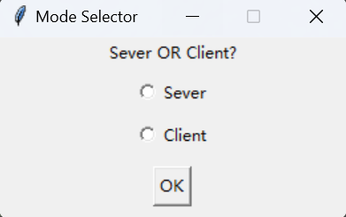
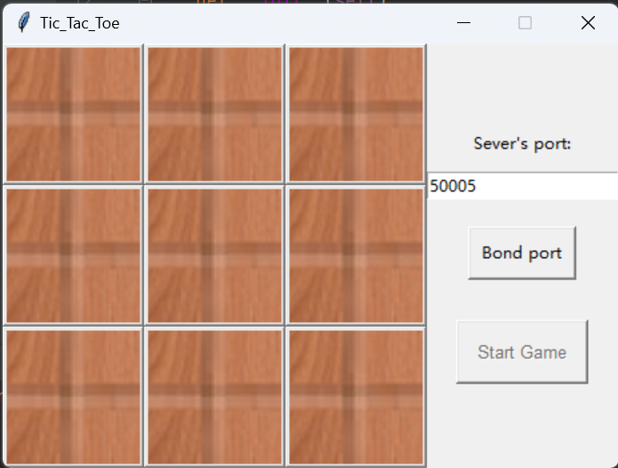
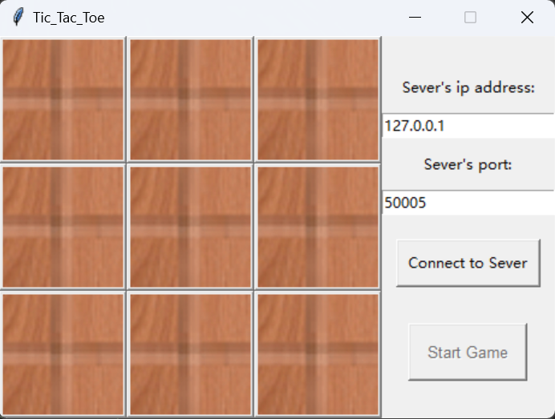

## 井字棋GUI界面

使用tkinter开发（比较简单，代码量少），使用时直接运行myGUI.py即可

其他文件是我的一些修改，还没有弄好。

未来可能使用pyqt5重新写一下，增加人机对战的功能。

感兴趣的朋友也可以自己尝试一下，接口在db_renji_qi.py中，我写好了使用minimax 的机器下棋，直接调用即可。

#### 功能介绍

##### 模式选择

> + 模式选择：  
>
> 	  
>
> 	选择用户端或者服务器端，点击ok进入相应程序。  
>
> + 服务器端：  
>
>       
>
>   输入绑定的端口号，点击绑定端口，等待客户端连接。  
>
> + 客户端：  
>
> 	  
>
> 	输入主机的ip地址和端口号，连接到服务器后开始游戏即可。  

##### 注：  

游戏结束后再次点击开始游戏可以重置棋盘。

如果想要打包成exe文件推荐使用虚拟打包，会极大缩小exe文件的大小。

还有问题等待完善，但是电子信息的课tmd又多又难，等有时间再说。这算一个雏形，反正完成作业是绰绰有余了。

和余俊老师上的这两节课是一点没离开井字棋呀哈哈哈:happy: